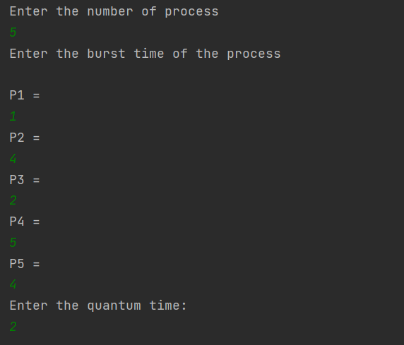
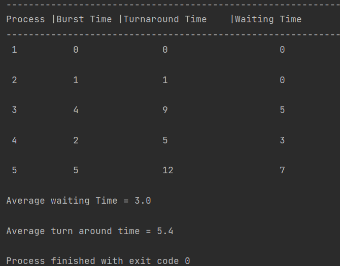
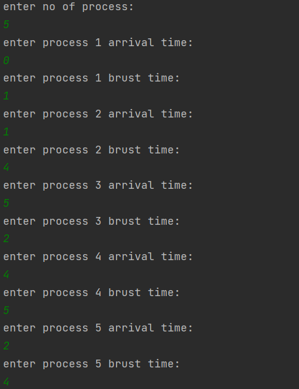

# CPU Scheduling Algorithms RR and SJF Implementation using Java
This project contains Java implementations of two CPU scheduling algorithms: Shortest Job First (SJF) and Round Robin (RR).
##SJF
Shortest job first (SJF) is a scheduling policy that selects the waiting process with the smallest execution time to execute next.
 The implementation of the SJF algorithm can be found in the https://github.com/Ayman1255/OS-algorithms/blob/main/SJF/SJF.java file
 the input:
 
 the output:
 
 ##RR
 Round robin (RR) is a scheduling policy that choose all elements in a group equally in some rational order,
 usually from the top to the bottom of a list and then starting again at the top of the list and so on.
 The implementation of the SJF algorithm can be found in the https://github.com/Ayman1255/OS-algorithms/blob/main/RR/RR.java file
 the input:
 
 the output:
 
